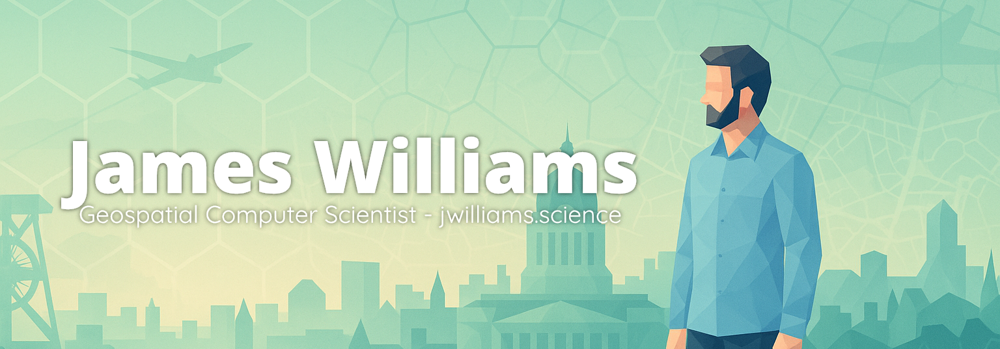

<code>Geospatial Computer Scientist</code>

I’m a Lecturer in Computer Science at **Birmingham Newman University** and a Research Associate with the **University of Nottingham** (“City as Lab” initiative). My work blends **geospatial data science, AI, and human-centred computing**, with a focus on how *places* shape experience, behaviour, and decision-making.  

---

## 🔬 Research & Open Tools
I create reproducible, open-source pipelines and platforms for place-based science:

- **[🌍 Platial Atlas](https://platialatlas.org/)** – global ETL and analytics pipeline for functional urban regions, built on H3, OSM, and PostGIS.
- **🧩 PlaceCrafter** – interactive framework for clustering OSM Points of Interest into functional regions.
- **🚶 WalkGIS** – mixed-methods framework for leisure walking, connecting route qualities to personalisation.
- **📡 StreetWise** – sensor deployment toolkit for smart urban sensing.

I aim to make all outputs **reproducible and openly available** for community use.

---

## 📚 Teaching & Learning
At Newman I lead modules in:

- **Cyber Security (CMU540)** – hands-on ethical hacking, security standards, and cyber risk.
- **Web Design (CMU422)** – HTML, CSS, and JS with client-facing project briefs.
- **Advanced Web Development (CMU529)** – Advanced web development using PHP, SQL, etc.

I build open-access lecture sites at [jwilliams.science/lectures](https://jwilliams.science/lectures).

---

## 💡 Current Directions
- Writing on **Liminal GIS**: understanding fuzzy, in-between geographies.
- Scaling the **Platial Atlas** towards 50–100 cities worldwide.
- Preparing relevant outputs across geospatial AI, urban studies, and leisure walking.

I enjoy blending **geospatial methods** with **creative design**, building both research pipelines and playful tools.

---

## 📫 Get in Touch
- 🌐 Website: [jwilliams.science](https://jwilliams.science)
- 📝 Blog: [blog.jwilliams.science](https://blog.jwilliams.science)

---
*Always open to collaborations at the intersection of geospatial science, open data, and playful computing.*
