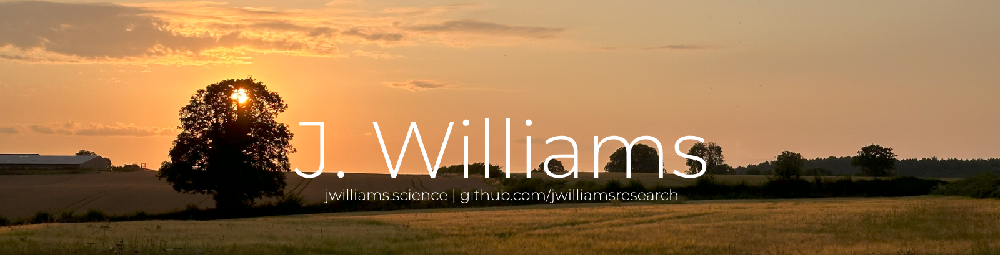

<code>Geospatial Computer Scientist</code>

I am a PhD candidate interested in developing software and technologies for representing place. My research interests are in Geographic Information Science, Platial Information, and Information Visualisation.

## Technologies

<code>[Currently a work-in-progress]</code>

      

   

## Credits

Initial ReadMe generated using GPRM: https://gprm.itsvg.in

Software icons using Devicon: https://devicon.dev/
