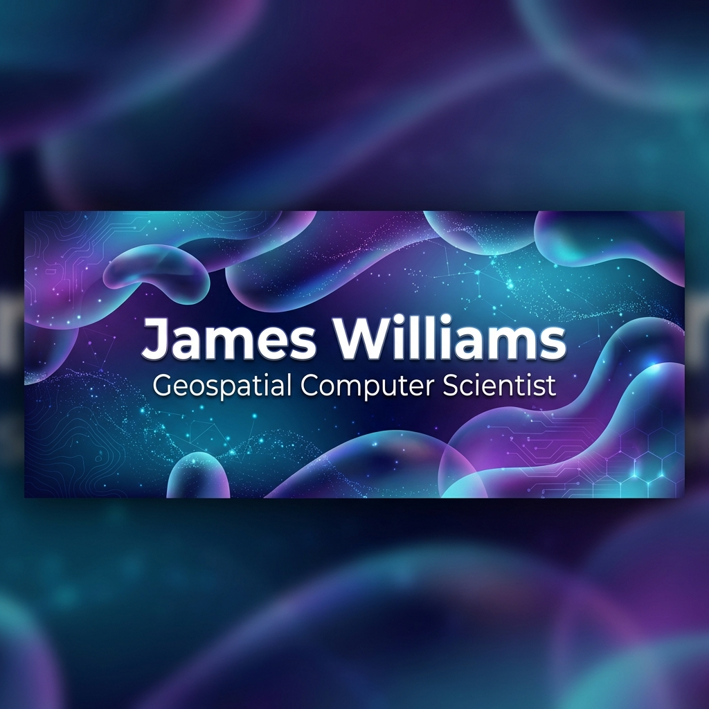
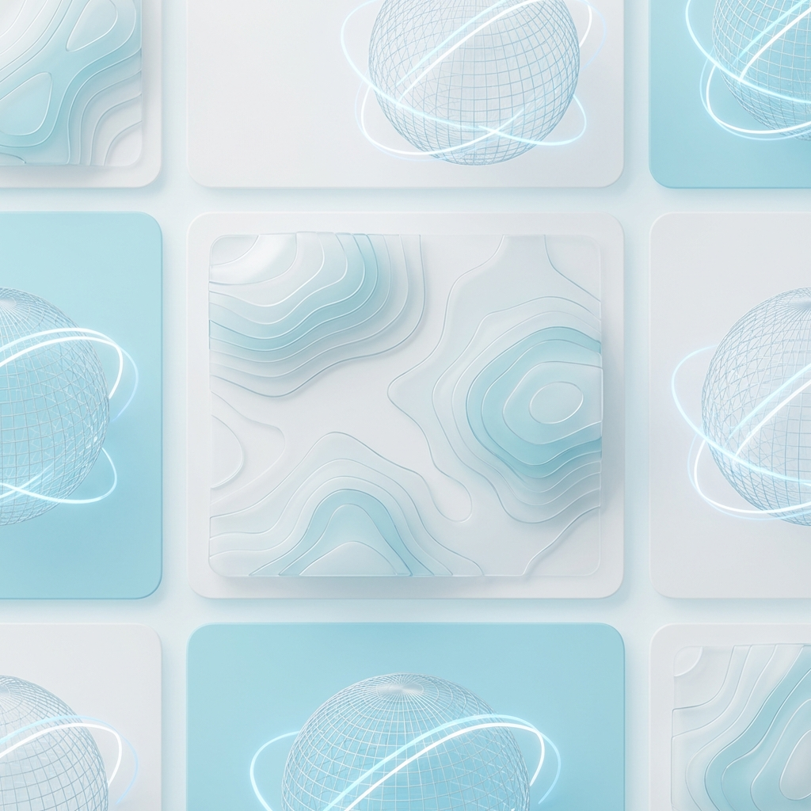
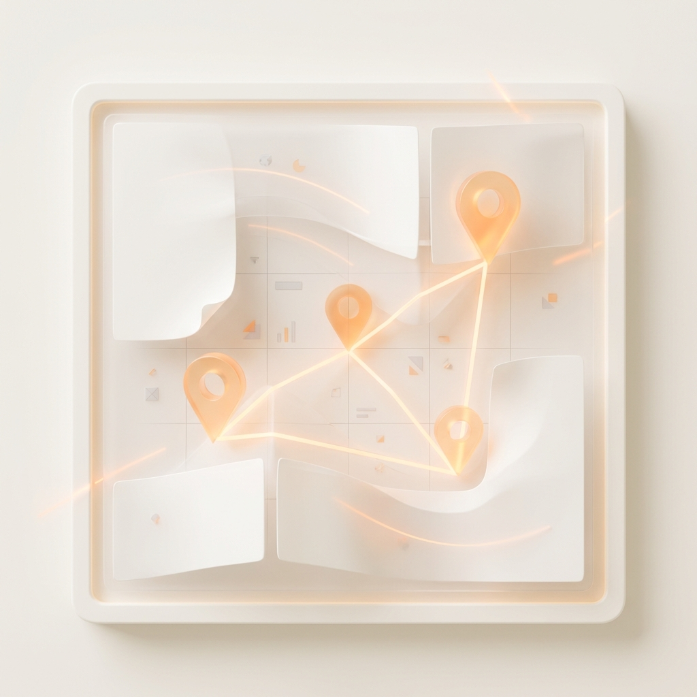
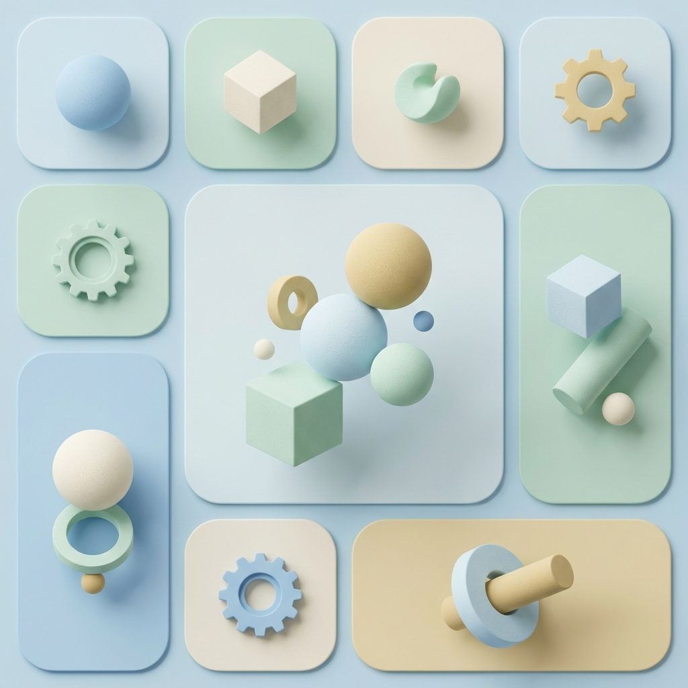
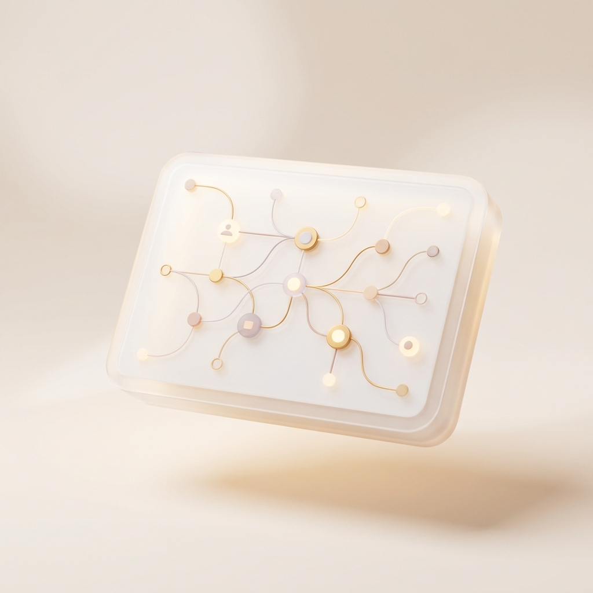

  

 

  <table border="0" width="100%" cellspacing="10" cellpadding="0">
    <tr>
      <!-- Research Profile Card -->
      <td width="33%" valign="top" align="center">
        
          
        

          Lecturer at Birmingham Newman University & Research Associate at University of Nottingham.
        

      </td>

      <!-- Chora Card -->
      <td width="33%" valign="top" align="center">
        
          
        

          The Platial Modelling Operating System. Simulating human experience of place.
        

      </td>

      <!-- Spatial Narrative Card -->
      <td width="33%" valign="top" align="center">
        
          
        

          High-performance library for indexing and analyzing events in space-time.
        

      </td>
    </tr>
    <tr>
      <!-- Platial Atlas -->
      <td width="33%" valign="top" align="center">
        
          
        

          Global ETL & Analytics pipeline for functional urban regions.
        

      </td>

      <!-- Tech Stack -->
      <td width="33%" valign="top" align="center">
        
          
        

          Python • Rust • Geospatial AI • React • Astro • PostGIS
        

      </td>

      <!-- Connect -->
      <td width="33%" valign="top" align="center">
        
          
        

          Collaboration & Supervision
        

      </td>
    </tr>
  </table>

 

<!-- Fluid Divider/Section specific styles -->

  <h2 style="color: white; font-family: sans-serif; border-bottom: 1px solid #444;">🔬 Research & Open Structure</h2>
  

    I build reproducible pipelines for <b>place-based science</b>, bridging the gap between quantitative GIS and qualitative human experience.
  

  <ul style="color: #bbb; font-family: sans-serif;">
    <li><strong style="color: #fff;">[PlaceAgents](https://jwilliams.science/research)</strong>: Simulating platial pedestrian flows.</li>
    <li><strong style="color: #fff;">[PlaceCrafter](https://jwilliams.science/projects/placecrafter)</strong>: Interactive POI clustering for functional regions.</li>
    <li><strong style="color: #fff;">[PARM-X](https://jwilliams.science/projects/parm-x)</strong>: Projection Augmented Relief Models.</li>
  </ul>

 

  <h2 style="color: white; font-family: sans-serif; border-bottom: 1px solid #444;">📚 Teaching</h2>
  <ul style="color: #bbb; font-family: sans-serif;">
    <li><strong style="color: #fff;">Cyber Security (CMU540)</strong>: Ethical hacking & risk.</li>
    <li><strong style="color: #fff;">Web Design (CMU422)</strong>: Modern frontend development.</li>
    <li><strong style="color: #fff;">Advanced Web (CMU529)</strong>: Full-stack applications.</li>
  </ul>
  

    Explore lectures at <a href="https://jwilliams.science/lectures" style="color: #00ffff;">jwilliams.science/lectures</a>.
  

 

  <a href="https://jwilliams.science" style="color: #00ffff; text-decoration: none; margin: 0 10px;">Website</a> • 
  <a href="https://blog.jwilliams.science" style="color: #00ffff; text-decoration: none; margin: 0 10px;">Blog</a> • 
  <a href="https://www.linkedin.com/in/jameswilliamssci/" style="color: #00ffff; text-decoration: none; margin: 0 10px;">LinkedIn</a> • 
  <a href="mailto:James.Williams4@Nottingham.ac.uk" style="color: #00ffff; text-decoration: none; margin: 0 10px;">Email</a>

